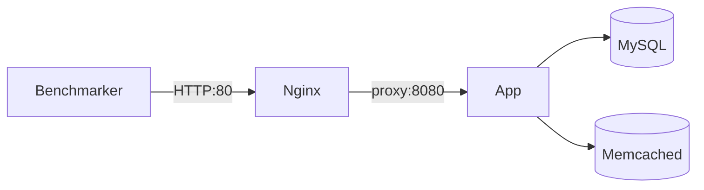

# ISUCON 研修チェックリスト（6 時間版）

## 前提

- **時間**: 6 時間（1 日）
- **完了済み**: SSH、ベンチ、Go 切替、インデックス、計測環境、N+1、SHA512、`GET /@xxx`、DB 接続プール、MySQL InnoDB チューニング、nginx gzip
- **ゴール**: 計測→改善→再計測のサイクルを 1 回以上回し、スコアを上げる。N+1 解消を体験する。
- **言語**: Go（`isu-go` / `webapp/golang/`）

## 基準スコア（記入欄）

```
初回スコア: 0（Go 素の状態）
初回 pass: true
計測日時: ___
最終スコア: 46899（nginx gzip 有効化後）
改善率: 約 +∞%（0 起点）
```

## 6 時間で捨てるもの（後回し OK）

- ローカル Docker 環境の構築（サーバ上で直接開発）
- 画像のファイル退避・nginx 直接配信（効果大だが実装時間がかかる）
- HTML / memcached キャッシュ（DOM 検証で fail リスクあり）
- ~~パスワードハッシュの openssl 置換~~ → **実施済み**
- 本番 ISUCON 当日の運用（研修後に別途）

---

## タイムテーブル

```mermaid
gantt
  title ISUCON研修 6時間スケジュール
  dateFormat HH:mm
  axisFormat %H:%M

  section 準備
  環境把握とデプロイ確認     :a1, 00:00, 30m

  section 計測
  alpとslow logセットアップ  :b1, 00:30, 30m

  section 改善
  N+1解消                    :c1, 01:00, 120m
  インデックスとクイックウィン :c2, after c1, 60m

  section 反復
  改善サイクル               :d1, 04:00, 90m
  振り返り                   :d2, after d1, 30m
```



---

## 0:00 – 0:30｜環境把握（30 分）

### やること（Must）

- [ ] サーバ構成を 5 分でメモ（app / db / memcached の IP と役割）
- [x] アプリの起動・再起動コマンドを 1 人が実行できるようにする（`isu-go` 起動済み）
- [x] コード反映方法を決める（`git pull` + 再起動 が最速）
- [x] nginx / MySQL / memcached の設定ファイル場所を確認（`scripts/*.example` あり）
- [x] 初回ベンチ + スコア記録

---

## 0:30 – 1:00｜計測ツールセットアップ（30 分）

### Must

- [x] MySQL slow query log を有効化
- [x] `alp` で nginx access log を解析
- [x] ベンチ → alp → slow log の順で「遅いパス」「重いクエリ」を Top 3 ずつメモ
- [x] `scripts/bench-analyze.sh` で一括解析

### 余裕があれば

- [ ] `pt-query-digest`（slow log の詳細分析）
- [ ] `htop` / `dstat` で CPU・メモリ確認

---

## 1:00 – 3:00｜N+1 解消（2 時間）★ メインイベント

### 実装

- [x] `makePosts` を JOIN / バルク取得に書き換え
- [x] デプロイ → 再起動 → ベンチ実行（36027）
- [x] スコアを記録
- [x] `pass: true` を維持

---

## 3:00 – 4:00｜インデックス + クイックウィン（1 時間）

### インデックス

- [x] `EXPLAIN` で主要クエリを確認してから追加
- [x] インデックス追加（`sql/add_indexes.sql` + `sql/add_index_comments_user_id.sql`）
- [x] 追加後にベンチ → スコア記録（0 → 15139）

### クイックウィン

| 施策 | 状態 | 備考 |
|------|------|------|
| nginx gzip 有効化 | [x] | `scripts/nginx-gzip.conf.example` |
| MySQL `innodb_buffer_pool_size` | [x] | 768M（`scripts/mysql-tuning.cnf.example`） |
| MySQL `innodb_flush_log_at_trx_commit=2` | [x] | 同上 |
| Go `SetMaxOpenConns(80)` 等 | [x] | `webapp/golang/app.go` |
| openssl → ネイティブ SHA512 | [x] | login/register |

- [x] 1 施策ごとにベンチ → 効果確認

---

## 4:00 – 5:30｜改善サイクル（90 分）

- [x] 改善サイクル 2〜3 回（`bench-analyze.sh` で反復計測済み）

### 実施済み（時間が余ったら枠）

1. ~~openssl subprocess → ネイティブハッシュ~~ → **実施済み**
2. ~~`GET /@xxx` のクエリ改善~~ → **実施済み**
3. `/posts/:id` の N+1 → **未実施**
4. `GET /image/:id.:ext` に `Cache-Control` / `ETag` → **未実施**

---

## 5:30 – 6:00｜振り返り（30 分）

- [x] 初回 vs 最終スコアを記録
- [ ] 効いた施策・効かなかった施策をメモ（下書きあり）
- [ ] 次回（本番 ISUCON 前）にやることを 3 つだけ書く

### 振り返りテンプレート

```
初回スコア: 0
最終スコア: 46899
改善率: 約 +∞%（0 起点）

効いた施策:
- N+1 解消（makePosts バルク取得）
- インデックス追加
- openssl → ネイティブ SHA512
- GET /@xxx クエリ改善
- Go DB 接続プール（SetMaxOpenConns=80）
- MySQL InnoDB チューニング（buffer pool 768M）
- nginx gzip（CSS/JS 圧縮）

効かなかった / 見送り:
- SetConnMaxLifetime（再接続コストでスコア低下）
- buffer pool 1G（メモリ 3.7GB 環境では 768M を採用）

次にやること:
1. GET / / GET /posts のクエリ改善
2. 画像のファイル退避
3. GET /image に Cache-Control / ETag
```

---

## 全チェックリスト（コンパクト）

### 完了済み

- [x] SSH 接続
- [x] ベンチマーカー実行
- [x] 初回ベンチ + 基準スコア記録
- [x] Ruby → Go 切り替え
- [x] openssl → ネイティブ SHA512
- [x] `GET /@xxx` クエリ改善
- [x] MySQL InnoDB チューニング
- [x] Go DB 接続プール
- [x] nginx gzip

### 0:00–0:30 準備

- [ ] サーバ構成メモ
- [x] デプロイ・再起動手順の確立

### 0:30–1:00 計測

- [x] slow query log 有効化
- [x] alp 導入
- [x] ボトルネック Top 3 メモ

### 1:00–3:00 N+1

- [x] `makePosts` の N+1 解消
- [x] ベンチ pass 確認 + スコア記録

### 3:00–4:00 インデックス + インフラ

- [x] インデックス追加
- [x] クイックウィン（gzip / InnoDB / 接続プール）

### 4:00–5:30 反復

- [x] 改善サイクル 2〜3 回

### 5:30–6:00 振り返り

- [ ] 振り返り最終記入

### 残タスク

- [ ] サーバ構成メモ
- [ ] `GET /` / `GET /posts` のクエリ改善
- [ ] 画像のファイル退避
- [ ] `GET /image/:id.:ext` に Cache-Control / ETag
- [ ] `/posts/:id` の N+1

---

## クイックリファレンス

### ベンチマーカー

```bash
cd benchmarker
./bin/benchmarker -t http://localhost -u ./userdata
./bin/benchmarker -t http://localhost -u ./userdata -debug  # 失敗時
bash scripts/bench-analyze.sh  # ベンチ + alp + slow log 一括
```

### 設定ファイル一覧

| ファイル | 配置先 |
|---------|--------|
| `scripts/mysql-slow-log.cnf.example` | `/etc/mysql/conf.d/isucon-slow-log.cnf` |
| `scripts/mysql-tuning.cnf.example` | `/etc/mysql/conf.d/isucon-tuning.cnf` |
| `scripts/nginx-ltsv.conf.example` | `/etc/nginx/sites-available/isucon.conf` |
| `scripts/nginx-gzip.conf.example` | `/etc/nginx/conf.d/isucon-gzip.conf` |
| `sql/add_indexes.sql` | MySQL に適用 |
| `sql/add_index_comments_user_id.sql` | MySQL に適用 |

### スコア推移

| タイミング | score |
|-----------|-------|
| Go 素の状態 | 0 |
| インデックス追加後 | 15139 |
| N+1 + SHA512 後 | 36027 |
| `GET /@xxx` 改善後 | 39342 |
| DB 接続プール後 | 45524 |
| nginx gzip 後 | **46899** |

### サービス構成



### ベンチマーカーの落とし穴

- `/initialize` はベンチ前に毎回呼ばれる（データリセット）
- 画像 URL に `Set-Cookie` を付けると login シナリオ fail
- ログイン状態を含む HTML キャッシュは DOM 検証 fail の原因
