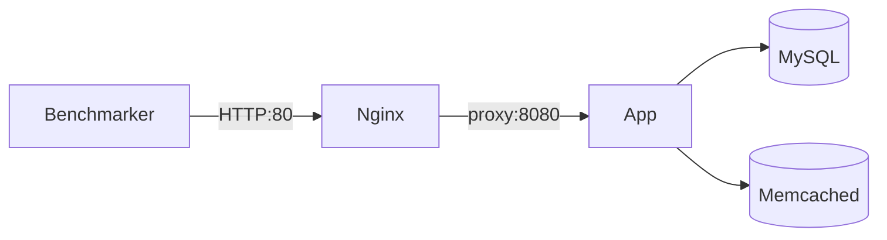

# ISUCON 研修チェックリスト（6 時間版）

## 前提

- **時間**: 6 時間（1 日）
- **完了済み**: SSH 接続、ベンチマーカー実行、**初回ベンチマーク（基準スコア）**
- **ゴール**: 計測→改善→再計測のサイクルを 1 回以上回し、スコアを上げる。N+1 解消を体験する。
- **言語**: サーバ上で既に動いている実装をそのまま使う（**言語切り替えはしない** — 時間がもったいない）。未デプロイなら Go（`webapp/golang/`）を推奨。

## 基準スコア（記入欄）

```
初回スコア: ___
初回 pass: ___
計測日時: ___
```

## 6 時間で捨てるもの（後回し OK）

- ローカル Docker 環境の構築（サーバ上で直接開発）
- 画像のファイル退避・nginx 直接配信（効果大だが実装時間がかかる）
- HTML / memcached キャッシュ（DOM 検証で fail リスクあり）
- パスワードハッシュの openssl 置換（効果は中程度、N+1 後に余裕があれば）
- 本番 ISUCON 当日の運用（研修後に別途）

---

## タイムテーブル

```mermaid
gantt
  title ISUCON研修 6時間スケジュール
  dateFormat HH:mm
  axisFormat %H:%M

  section 準備
  環境把握とデプロイ確認     :a1, 00:00, 30m

  section 計測
  alpとslow logセットアップ  :b1, 00:30, 30m

  section 改善
  N+1解消                    :c1, 01:00, 120m
  インデックスとクイックウィン :c2, after c1, 60m

  section 反復
  改善サイクル               :d1, 04:00, 90m
  振り返り                   :d2, after d1, 30m
```



---

## 0:00 – 0:30｜環境把握（30 分）

初回ベンチは取得済みのため、環境把握とデプロイフローの確立に集中する。

### やること（Must）

- [ ] サーバ構成を 5 分でメモ（app / db / memcached の IP と役割）
- [ ] アプリの起動・再起動コマンドを 1 人が実行できるようにする
- [ ] コード反映方法を決める（`git pull` + 再起動 が最速）
- [ ] nginx / MySQL / memcached の設定ファイル場所を確認
- [x] 初回ベンチ + スコア記録（完了 — 上記「基準スコア」欄に記入）

### チーム分担（3〜4 人想定）

| 役割 | 担当 |
|------|------|
| 計測・ベンチ実行 | 1 人 |
| アプリ修正 | 1〜2 人 |
| DB / インフラ | 1 人 |

### スキップ可

- ローカル compose 起動
- `~/.ssh/config` の整備（時間があれば）

---

## 0:30 – 1:00｜計測ツールセットアップ（30 分）

ベンチ 1 回 → ログ解析、のループを回せる状態にする。

### Must

- [ ] MySQL slow query log を有効化

```sql
SET GLOBAL slow_query_log = 1;
SET GLOBAL long_query_time = 0.1;
-- 永続化は my.cnf（時間があれば）
```

- [ ] `alp` で nginx access log を解析

```bash
# インストール例（macOS）
brew install alp
# ベンチ後
sudo alp json --file /var/log/nginx/access.log
```

- [ ] ベンチ → alp → slow log の順で「遅いパス」「重いクエリ」を Top 3 ずつメモ

### 余裕があれば

- [ ] `pt-query-digest`（slow log の詳細分析）
- [ ] `htop` / `dstat` で CPU・メモリ確認

---

## 1:00 – 3:00｜N+1 解消（2 時間）★ メインイベント

6 時間の半分をここに使う。効果が最も大きい。

### 理解（15 分、コードを読むだけ）

`webapp/golang/app.go` または使用中言語の `makePosts` / `make_posts` 相当を開く。

1 ページ（20 投稿）あたり **80+ クエリ** が発生している典型パターン:

1. コメント数 `COUNT`
2. 最新コメント 3 件 `SELECT`
3. コメント投稿者 `SELECT`（×3）
4. 投稿者 `SELECT`（×20）

ベンチが重点的に叩くパス:

| パス | 優先度 |
|------|--------|
| `GET /` | 最高 |
| `GET /posts?max_created_at=...` | 最高 |
| `GET /@:account_name` | 高 |
| `GET /posts/:id` | 高 |

### 実装（1 時間 45 分）

- [ ] `makePosts` を JOIN / バルク取得に書き換え
  - 投稿 20 件を 1 クエリで取得
  - コメント数を `GROUP BY post_id` で一括取得
  - 最新コメント 3 件をサブクエリ or ウィンドウ関数で一括取得
  - ユーザー情報を `WHERE id IN (...)` で一括取得
- [ ] デプロイ → 再起動 → **ベンチ実行**
- [ ] スコアを記録（改善幅を確認）
- [ ] `pass: true` を維持（DOM 構造を変えない）

### 失敗時

- [ ] `./bin/benchmarker -debug` で失敗メッセージ確認
- [ ] 変更を revert して pass に戻してから次の施策へ

---

## 3:00 – 4:00｜インデックス + クイックウィン（1 時間）

N+1 後もまだ遅い場合、ここで追加改善。

### インデックス（30 分）

- [ ] `EXPLAIN` で主要クエリを確認してから追加

```sql
-- よく効くインデックス
CREATE INDEX idx_posts_created_at ON posts(created_at);
CREATE INDEX idx_posts_user_created ON posts(user_id, created_at);
CREATE INDEX idx_comments_post_created ON comments(post_id, created_at);
```

- [ ] 追加後にベンチ → スコア記録

### クイックウィン（30 分、余裕に応じて 1〜2 個）

| 施策 | 所要時間 | 効果 |
|------|----------|------|
| nginx gzip 有効化 | 5 分 | 中 |
| MySQL `innodb_buffer_pool_size` 増加 | 10 分 | 中 |
| Go: `SetMaxOpenConns(80)` 等 | 5 分 | 小〜中 |
| Ruby: Unicorn worker 数増加 | 5 分 | 小〜中 |

- [ ] 1 施策ごとにベンチ → 効果がなければ revert

---

## 4:00 – 5:30｜改善サイクル（90 分）

「ベンチ → alp → 修正 → ベンチ」を **2〜3 回** 回す。

### ループ

```
1. ベンチ実行 → スコア記録
2. alp / slow log でボトルネック確認
3. 小さく 1 点修正
4. デプロイ → 再起動
5. ベンチ → スコア比較
```

### 時間が余ったら（優先度順）

1. `/posts/:id` の N+1（詳細ページのコメント一覧）
2. `GET /image/:id.:ext` に `Cache-Control` / `ETag` 追加
3. openssl subprocess → ネイティブハッシュ（Go/Ruby）

### 時間が足りない場合

- 4:00 時点のスコアで打ち切り OK
- N+1 + インデックスだけでも研修目的は達成

---

## 5:30 – 6:00｜振り返り（30 分）

- [ ] 初回 vs 最終スコアを記録
- [ ] 効いた施策・効かなかった施策をメモ
- [ ] 次回（本番 ISUCON 前）にやることを 3 つだけ書く

### 振り返りテンプレート

```
初回スコア: ___
最終スコア: ___
改善率: ___%

効いた施策:
-

次にやること:
1. 画像のファイル退避
2. alp + pt-query-digest の習熟
3. （その他）
```

---

## 全チェックリスト（コンパクト）

### 完了済み

- [x] SSH 接続
- [x] ベンチマーカー実行
- [x] 初回ベンチ + 基準スコア記録

### 0:00–0:30 準備

- [ ] サーバ構成メモ
- [ ] デプロイ・再起動手順の確立

### 0:30–1:00 計測

- [ ] slow query log 有効化
- [ ] alp 導入
- [ ] ボトルネック Top 3 メモ

### 1:00–3:00 N+1（最重要）

- [ ] `makePosts` の N+1 解消
- [ ] ベンチ pass 確認 + スコア記録

### 3:00–4:00 インデックス + インフラ

- [ ] インデックス 3 本追加
- [ ] nginx gzip 等クイックウィン 1〜2 個

### 4:00–5:30 反復

- [ ] 改善サイクル 2〜3 回

### 5:30–6:00 振り返り

- [ ] スコア比較・施策メモ・次回 TODO

---

## クイックリファレンス

### ベンチマーカー

```bash
cd benchmarker
./bin/benchmarker -t http://<app-server> -u ./userdata
./bin/benchmarker -t http://<app-server> -u ./userdata -debug  # 失敗時
```

### スコア JSON

- `pass: false` → 事前検証失敗 or リクエスト失敗あり。`-debug` で原因確認
- GET +1 / POST +2 / 画像投稿 +5 / 失敗 -10〜-20

### サービス構成



### ベンチマーカーの落とし穴

- `/initialize` はベンチ前に毎回呼ばれる（データリセット）
- 画像 URL に `Set-Cookie` を付けると login シナリオ fail
- ログイン状態を含む HTML キャッシュは DOM 検証 fail の原因
